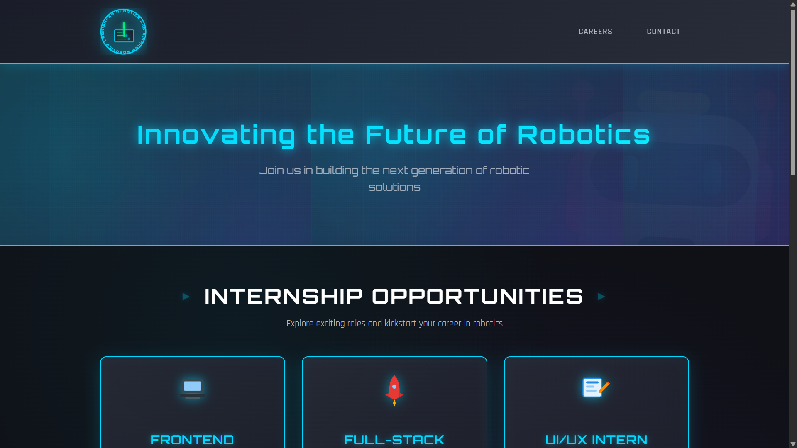
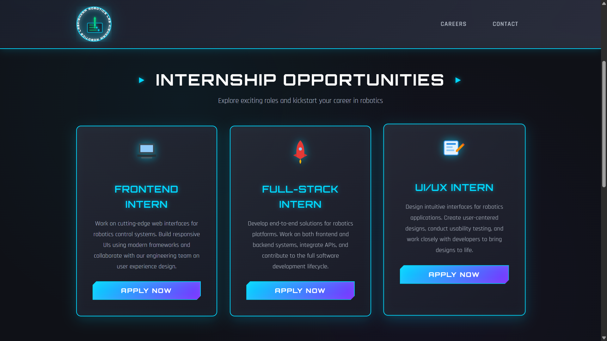
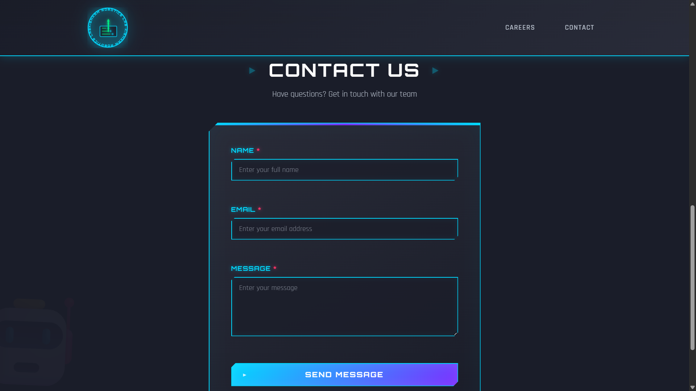
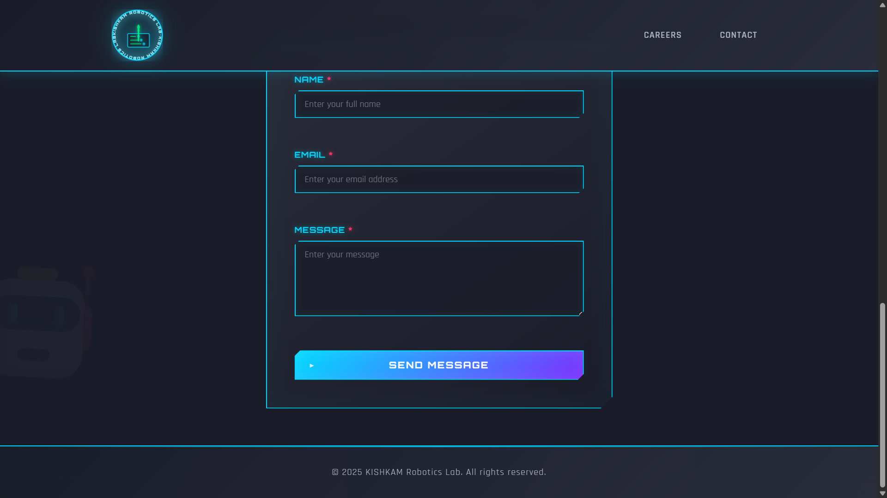

# 🤖 KISHKAM Robotics Lab – Careers & Contact Website

A futuristic, responsive **careers and contact website** built for **KISHKAM Robotics Lab**, showcasing internship opportunities and enabling users to contact the team through a validated form.

Designed with a **robotics-inspired neon UI**, smooth animations, and clean frontend architecture using **HTML, CSS, and Vanilla JavaScript**.

---

## 📸 Screenshots

### 🖥️ Homepage & Hero Section

### 💼 Internship Opportunities Section

### ✉️ Contact Form with Validation

### ✉️ Footer

---

## ✨ Features

### 🎯 UI & UX
- Futuristic **robotics-themed neon design**
- Animated SVG logo with hover rotation
- Fully responsive layout (mobile → desktop)
- Smooth scrolling navigation
- Interactive hover & glow effects

### 💼 Careers Section
- Internship cards for:
  - Frontend Intern
  - Full-Stack Intern
  - UI/UX Intern
- “Apply Now” button auto-fills the contact form
- Scrolls smoothly to the contact section

### ✉️ Contact Form
- Client-side validation (Name, Email, Message)
- Inline error handling with animations
- Success message with auto-hide
- Stores submissions in **localStorage**
- Keeps only the latest 50 submissions (memory-safe)

### ⚙️ JavaScript Functionality
- Real-time form validation
- Regex-based email verification
- localStorage integration
- Dynamic notification system
- Auto-prefill message based on selected role

---

## 🛠️ Tech Stack

| Technology | Usage |
|----------|------|
| **HTML5** | Page structure & semantics |
| **CSS3** | Styling, animations, responsive design |
| **JavaScript (ES6)** | Form validation, interactivity |
| **SVG** | Animated logo & icons |
| **Google Fonts** | Orbitron & Rajdhani |

---

## 📂 Project Structure

📁 kishkam-robotics-lab
│
├── index.html # Main HTML file
├── style.css # Complete UI styling & animations
├── script.js # Form logic & interactivity
├── logo.png # Website favicon/logo
├── screenshots/ # Project screenshots
│ ├── screenshot-1.png
│ ├── screenshot-2.png
│ └── screenshot-3.png
└── README.md # Project documentation

---

## 🧠 How It Works (Quick Breakdown)

- **HTML** defines sections: Header, Hero, Careers, Contact, Footer
- **CSS** handles:
  - Neon glow effects
  - Keyframe animations
  - Responsive grid layouts
- **JavaScript**:
  - Validates user inputs
  - Displays error/success messages
  - Saves form data in `localStorage`
  - Auto-fills message when applying for roles

---

## ✅ Form Validation Rules

- **Name**: Minimum 2 characters
- **Email**: Valid email format (Regex-based)
- **Message**: Minimum 10 characters

---

## 📌 Future Enhancements (Optional Ideas)

- Backend integration (Node.js + MongoDB)
- Email notifications on form submission
- Admin dashboard for submissions
- Dark/Light theme toggle
- Accessibility improvements (ARIA)

---

## 👨‍💻 Author

**Dev Kaushal**  
Frontend Developer | Engineering Student  
Passionate about building clean, interactive web experiences 🚀

---

## 📜 License

This project is open-source and free to use for learning and portfolio purposes.

---

## 🌐 Deployment (GitHub Pages)

The project is successfully deployed using **GitHub Pages** and can be accessed publicly at the link below:

🔗 **Live Website:**  
https://devkaushal989.github.io/Kishkam-Robotics-Lab-problem_statement-/

### 🚀 Deployment Details
- Platform: **GitHub Pages**
- Branch Used: `main`
- Deployment Type: Static Frontend
- No backend or server configuration required

You can clone the repository and deploy it locally or on any static hosting platform (GitHub Pages, Netlify, Vercel) without additional setup.

---

✅ **Status:** Live & Accessible  
🛠️ **Maintenance:** Easy to update by pushing changes to the repository